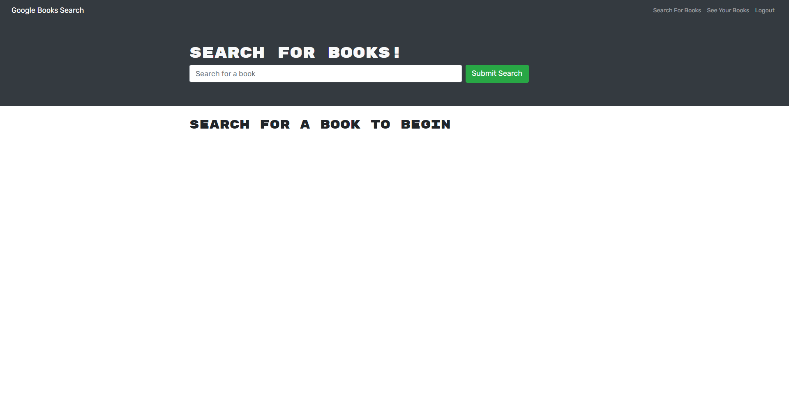
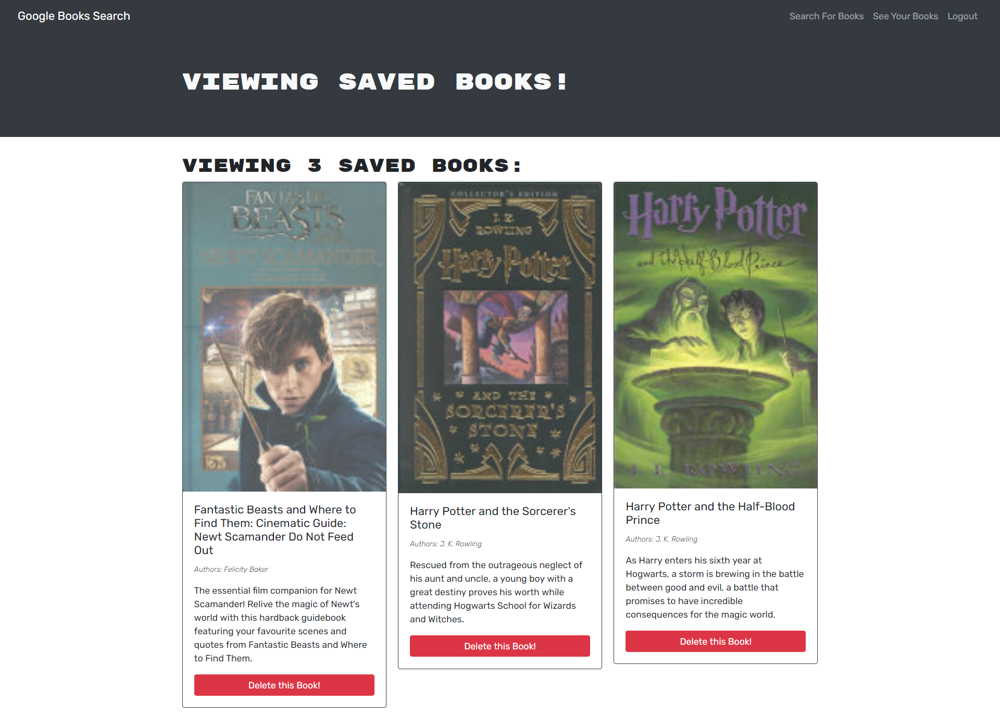

# MERN Book Search Engine

## Table of Contents

- [Description](#description-)
- [Licenses](#licenses-)
- [Installation](#installation-)
- [Usage](#usage-)
- [Technologies](#technologies-)
- [Screen shots](#screen-shots-)
- [Credits](#credits-)
- [Contributions](#contributions-)
- [Questions](#questions-)

## Description :

This is a MERN stack book search engine and as the name suggests it uses MongoDB, Express.js, React.js, and Node.js it also uses the graphQL instead of the more traditional RESTful API to query from the MongoDB. GraphQL is a lot simpler to set up than the RESTful APIs due to the lack of need for setup a route for each query and in RESTful API you need to setup a GET, POST, PUT, DELETE, and PATCH GraphQL gets a way with only post queries but of course each has its advantages and disadvantages. All of the information saved to a MongoDB atlas database and the Authorization of this webapp handled with JWT json web tokens.

## Licenses :

[](https://opensource.org/licenses/MIT)

[Click here to see the running MERN Book Search Engine!](https://tranquil-mountain-95428.herokuapp.com/)

## Installation :

To install the MERN Book Search Engine App use the instructions bellow &#8595;

```
npm istall
```

## Usage :

Users need to sign up to save their favorite books to their book list and they can pick up where they left of at later time and search for books to add to their saved book list or they can delete those books they read.

## Technologies :

- MongoDB.
- Express.js.
- React.js.
- Node.js.
- JavaScript.
- MongoDB Atlas.
- Bootstrap.
- Apollo server.
- JWT Json-Web-Token.
- Mongoose.
- Bcrypt.
- GraphQL.
- Concurrently during development.
- React Hooks.

## Screen shots :

### Here are screen shots of my deployed MERN Book Search Engine App!





## Credits :

- [Muiasar-Al-Ani](https://github.com/Muiasar-Al-Ani)

## Contributions :

    Contributions, issues, and feature requests are welcome!
    Give a ⭐️ if you like this project!

## Questions :

If you have any Question please feel free to contact me:

- muiasar2012@gmail.com
- [Muiasar-Al-Ani](https://github.com/Muiasar-Al-Ani)

&copy; 2021 [MERN Book Search Engine](https://github.com/Muiasar-Al-Ani)
